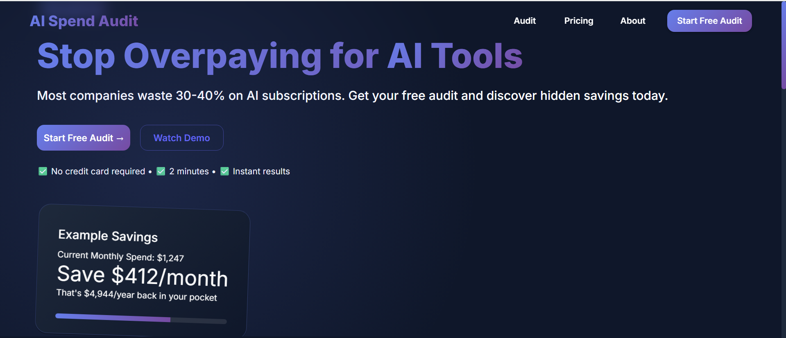
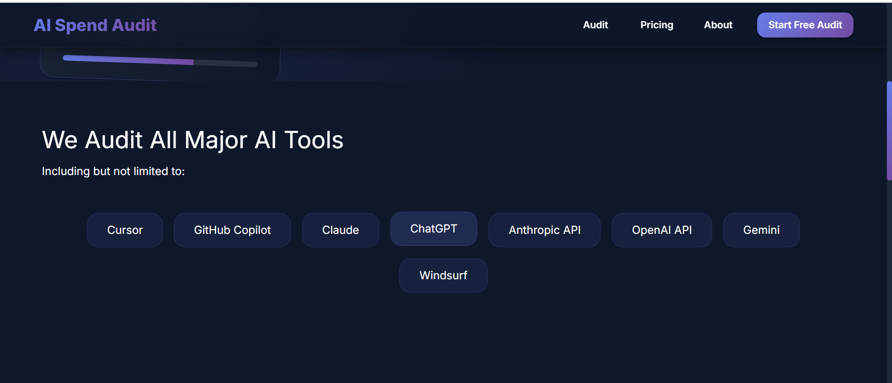
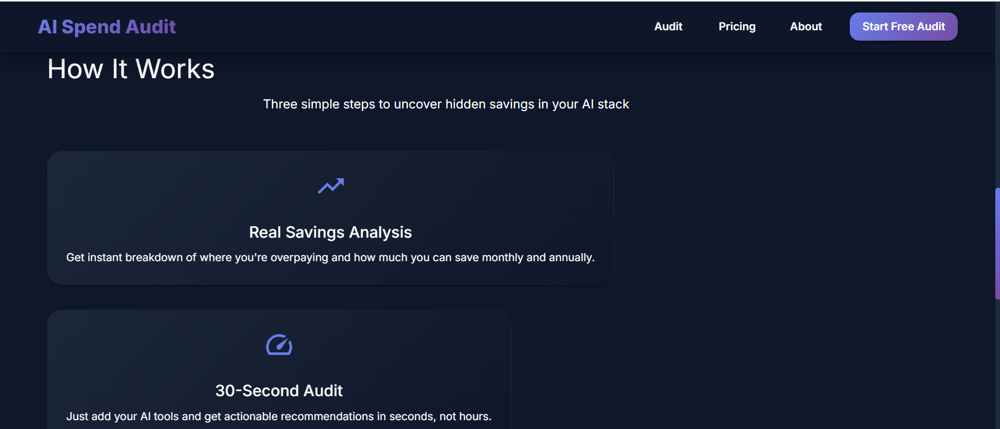
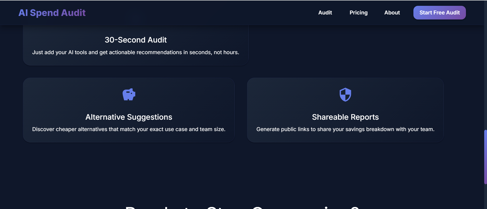
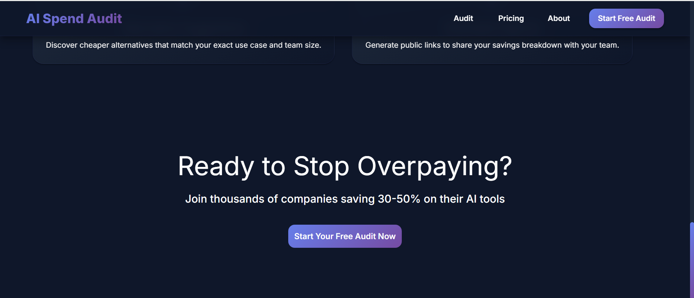
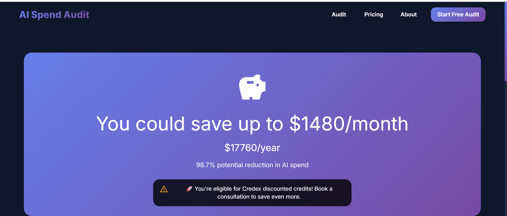
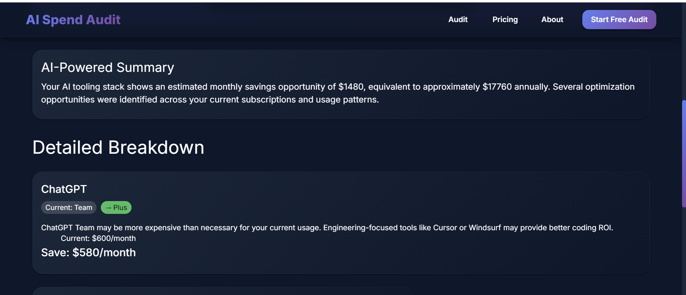
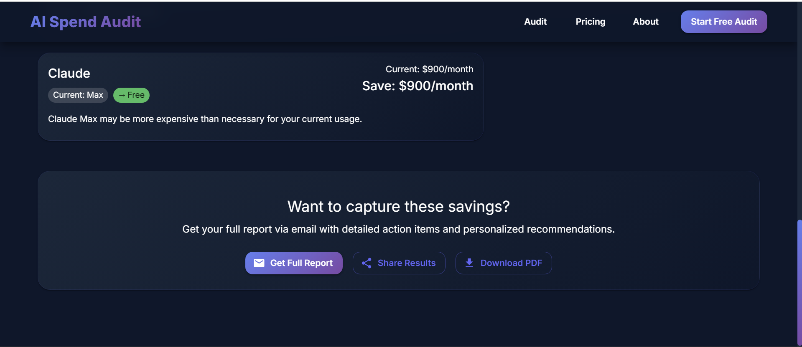
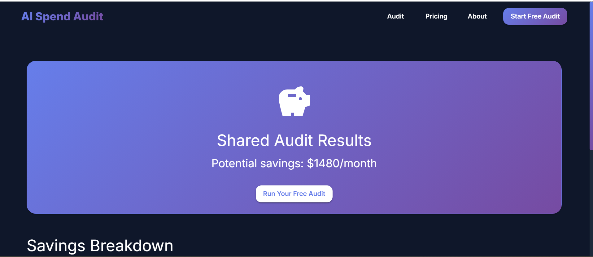
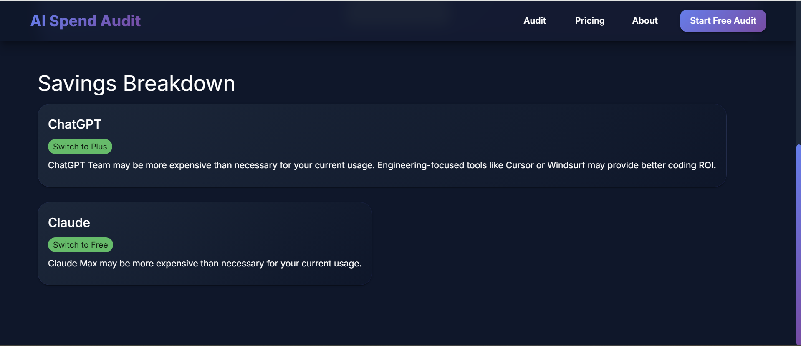

# AI Spend Audit

AI Spend Audit is a full-stack SaaS-style application that helps startups analyze and optimize AI tooling costs.

## Live Demo

Frontend:
https://ai-spend-audit-theta-sable.vercel.app

Backend:
https://ai-spend-audit-m5pp.onrender.com

---

## Features

- AI spend audit generation
- Cost optimization recommendations
- AI-generated audit summaries
- Lead capture system
- Shareable public audit URLs
- PDF report download
- Abuse protection with rate limiting + honeypot
- Responsive modern UI

---

## Tech Stack

### Frontend
- React + Vite
- Material UI
- React Router
- Axios
- Framer Motion

### Backend
- Node.js
- Express.js
- MongoDB Atlas
- OpenAI API
- Resend Email API

---

## Architecture

The application uses a layered backend architecture:

- Routes
- Controllers
- Services
- Middleware
- Models

Business logic is separated into reusable services for scalability and maintainability.

---

## AI Integration

AI summaries are generated using OpenAI.

Graceful fallback summaries are returned if the AI provider fails or exceeds quota limits.

---

## Abuse Protection

Implemented:
- Express rate limiting
- Honeypot hidden field protection

This reduces spam and automated abuse without harming user experience.

---

## Shareable Public URLs

Each audit generates a unique public URL.

Public routes exclude identifying user information while preserving recommendations and savings data.

## Key Decisions & Tradeoffs

1. Used MongoDB Atlas instead of Postgres for faster MVP iteration and easier document modeling.

2. Separated deterministic audit calculations from AI summaries to avoid hallucinated savings recommendations.

3. Chose lightweight abuse protection (rate limiting + honeypot) instead of CAPTCHA to reduce user friction.

4. Used Vercel + Render deployment stack for simplicity and fast iteration on free tiers.

5. Prioritized feature completeness and stability over advanced social preview infrastructure.

## Demo

Loom Video:
https://drive.google.com/file/d/1ksZyJsps8eVBIVdttr-4Nd6eW1CKNzz5/view?usp=sharing

Screenshots:
- Landing page:

- Audit results:

- Share page

---

## Local Setup

### Backend

cd server

npm install

npm run dev

### Frontend

cd client

npm install

npm run dev

---

## Environment Variables

### Backend

PORT=
MONGODB_URI=
OPENAI_API_KEY=
RESEND_API_KEY=

---

## Deployment

- Frontend deployed on Vercel
- Backend deployed on Render
- Database hosted on MongoDB Atlas